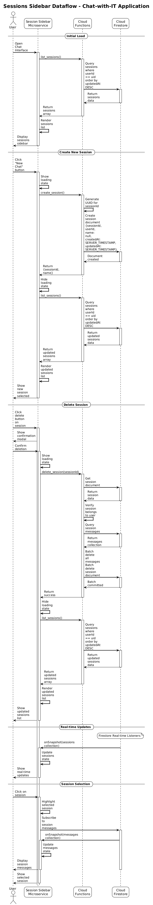
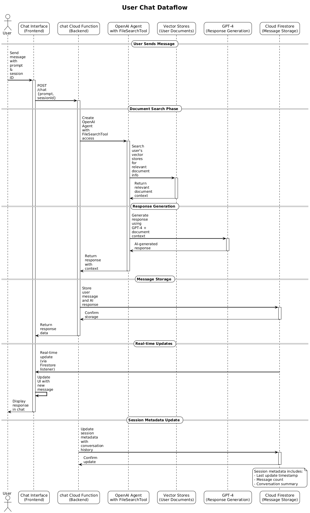
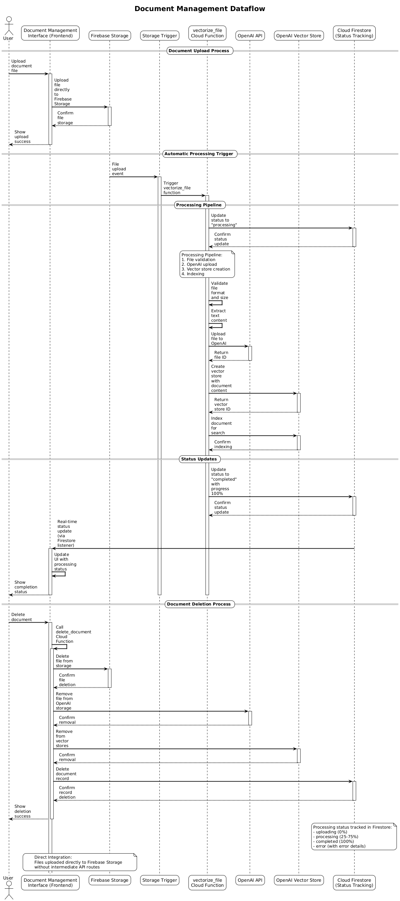

# Chat-with-IT

This is a simple AI-powered document chat application that allows users to upload documents, process them with AI, and have intelligent conversations about their content.

You can access the application by visiting the following URL: [https://chat-with-it.vercel.app/](https://chat-with-it.vercel.app/)


## Technologies Used

### Frontend Technologies
- **Next.js 14** - React framework for production
- **React 18** - UI library for building user interfaces
- **TypeScript** - Type-safe JavaScript development
- **Tailwind CSS** - Utility-first CSS framework
- **Vercel** - Deployment and hosting platform

### Backend Technologies
- **Firebase Cloud Functions** - Serverless backend processing
- **Python 3** - Multipurpose programming language
- **OpenAI API** - AI services integration (GPT-4, Vector Store, FileSearch)
- **Google Cloud Platform** - Cloud infrastructure

### Database & Storage
- **Cloud Firestore** - NoSQL document database with real-time capabilities
- **Google Cloud Storage** - Object storage for document files
- **Firebase Authentication** - User authentication and authorization

### AI & Machine Learning
- **OpenAI GPT-4.1** - Large language model for conversation
- **OpenAI Vector Store** - Document embedding
- **OpenAI FileSearch** - Semantic document search (RAG) capabilities


<br>

## System Architecture

The application consists of three main frontend microservices, each with its own data flow:

### 1. Sessions Sidebar

**Dataflow Description:**
- User interacts with the Sessions Sidebar to create, list, or delete chat sessions
- Frontend calls Cloud Functions (`create_session`, `list_sessions`, `delete_session`)
- Cloud Functions manage session data in Cloud Firestore
- Real-time listeners provide instant updates when sessions are modified
- Session metadata includes name, creation date, and last update timestamp

<br>

The sequence diagrams below detail the flow of data beteewn the main system components for each event.



<br>

### 2. User Chat

**Dataflow Description:**
- User sends messages through the Chat Interface
- Frontend calls the `chat` Cloud Function with user prompt and session ID
- Cloud Function creates an OpenAI Agent with FileSearchTool access
- Agent searches user's vector stores for relevant document information
- Agent generates response using GPT-4 and document context
- Messages are stored in Cloud Firestore with real-time updates
- Session metadata is updated with conversation history

<br>

The sequence diagram below detail the flow of data beteewn the main system components for each event.



<br>

### 3. Document Management

**Dataflow Description:**
- User uploads documents through Document Management interface
- Files are stored in Google Cloud Storage
- Storage trigger automatically calls `vectorize_file` Cloud Function
- Processing pipeline: file validation → OpenAI upload → vector store creation → indexing
- Real-time status updates via Cloud Firestore
- Document deletion removes files from both OpenAI storage and vector stores
- Processing status tracked in Firestore with progress percentages

<br>

The sequence diagram below detail the flow of data beteewn the main system components for each event.



<br>


## Key Components

### Frontend Microservices
- **Sessions Sidebar**: Manages chat session lifecycle
- **User Chat**: Handles AI conversations with document context
- **Document Management**: Processes and manages uploaded documents

### Backend Services
- **Cloud Functions**: Serverless backend processing
- **Cloud Firestore**: Real-time database for sessions and metadata
- **Google Cloud Storage**: Document file storage
- **OpenAI Vector Store**: AI-powered document indexing and search
- **OpenAI Agent**: Intelligent conversation processing

### Data Flow Patterns
- **Real-time Updates**: Firestore listeners for instant UI updates
- **Event-driven Processing**: Storage triggers for automatic document processing
- **AI Integration**: OpenAI services for document understanding and conversation
- **User Authentication**: Firebase Auth for secure access control

<br>
<br>

The following sections provide detailed information specific to the frontend and backend components of this project.

## Frontend

This is the Next.js frontend application for the Chat with It system. It provides a modern, responsive interface for users to interact with the AI agent and manage company documents.

### Features

- **Authentication**: Firebase Authentication with email/password login and signup
- **Chat Interface**: Real-time chat interface with session management and message history
- **Document Management**: Upload, process, and manage company documents with real-time status updates
- **Protected Routes**: Secure access to authenticated features
- **Responsive Design**: Modern UI built with Tailwind CSS
- **Toast Notifications**: User feedback system for actions and errors
- **Session Management**: Chat session persistence and management

### Tech Stack

- **Frontend**: Next.js 14 with TypeScript
- **Styling**: Tailwind CSS with class-variance-authority and clsx
- **Authentication**: Firebase Auth
- **Database**: Firestore (for chat sessions and user data)
- **Storage**: Firebase Storage (for document uploads)
- **Icons**: Lucide React
- **Markdown**: React Markdown for message rendering
- **State Management**: React Context for authentication

### Project Structure

```
ui/
├── app/                    # Next.js app directory
│   ├── (auth)/            # Authentication pages
│   │   ├── login/         # Login page
│   │   └── signup/        # Signup page
│   ├── (dashboard)/       # Protected dashboard pages
│   │   ├── chat/          # Chat interface
│   │   └── documents/     # Document management
│   ├── globals.css        # Global styles
│   ├── layout.tsx         # Root layout
│   └── page.tsx           # Home page
├── components/            # React components
│   ├── auth-provider.tsx  # Authentication context
│   ├── protected-route.tsx # Route protection
│   ├── dashboard-layout.tsx # Dashboard layout
│   ├── toast.tsx          # Toast notification system
│   ├── chat-interface/    # Chat components
│   │   ├── index.tsx      # Main chat interface
│   │   ├── assistant-message.tsx # AI message component
│   │   ├── session-sidebar.tsx # Chat session management
│   │   ├── interfaces.ts  # TypeScript interfaces
│   │   └── services.ts    # Chat-related services
│   └── document-management/ # Document management components
│       ├── index.tsx      # Main document interface
│       ├── test-notifications.tsx # Notification testing
│       ├── interfaces.ts  # TypeScript interfaces
│       └── services.ts    # Document-related services
├── lib/                   # Utility libraries
│   ├── firebase.ts        # Firebase configuration
│   ├── auth.ts           # Authentication utilities
│   └── utils.ts          # General utilities
├── public/               # Static assets
├── vercel.json           # Vercel deployment configuration
└── .gitignore           # Git ignore rules
```

### Setup Instructions

#### Prerequisites

- Node.js 18+ 
- npm or yarn
- Firebase project (for authentication, storage, and database)

#### Installation

1. **Clone the repository and navigate to the UI directory:**
   ```bash
   cd ui
   ```

2. **Install dependencies:**
   ```bash
   npm install
   ```

3. **Set up environment variables:**
   Create a `.env.local` file in the `ui` directory:
   ```env
   NEXT_PUBLIC_FIREBASE_API_KEY=your_firebase_api_key
   NEXT_PUBLIC_FIREBASE_AUTH_DOMAIN=your_project.firebaseapp.com
   NEXT_PUBLIC_FIREBASE_PROJECT_ID=your_project_id
   NEXT_PUBLIC_FIREBASE_STORAGE_BUCKET=your_project.appspot.com
   NEXT_PUBLIC_FIREBASE_MESSAGING_SENDER_ID=your_messaging_sender_id
   NEXT_PUBLIC_FIREBASE_APP_ID=your_app_id
   ```

4. **Run the development server:**
   ```bash
   npm run dev
   ```

5. **Open your browser and navigate to:**
   ```
   http://localhost:3000
   ```

### Firebase Setup

1. **Create a Firebase project** at [Firebase Console](https://console.firebase.google.com/)

2. **Enable Authentication:**
   - Go to Authentication > Sign-in method
   - Enable Email/Password authentication

3. **Set up Firestore Database:**
   - Go to Firestore Database > Create database
   - Choose production mode or test mode
   - Set up security rules for user data

4. **Configure Storage:**
   - Go to Storage > Get started
   - Set up security rules for file uploads

5. **Get your Firebase config:**
   - Go to Project Settings > General
   - Scroll down to "Your apps" section
   - Add a web app if you haven't already
   - Copy the configuration object

6. **Update your `.env.local`** with the Firebase config values

### Usage

#### Authentication
- Users can sign up with email and password
- Users can sign in with their credentials
- Protected routes automatically redirect to login
- Authentication state is persisted across sessions

#### Chat Interface
- Real-time chat with AI assistant
- Session management with multiple chat sessions
- Message history with markdown rendering
- Loading states and error handling
- Responsive design for mobile and desktop
- Assistant message formatting with code highlighting

#### Document Management
- Upload multiple document types (PDF, DOC, DOCX, TXT)
- Real-time upload progress tracking
- Document processing status updates
- File deletion with confirmation
- Toast notifications for user feedback

### API Endpoints

#### `/api/chat`
- **Method**: POST
- **Body**: `{ message: string, userId: string }`
- **Response**: `{ response: string }`
- **Note**: Currently returns mock responses, will be integrated with Google Cloud Functions

#### `/api/upload`
- **Method**: POST
- **Body**: FormData with file and userId
- **Response**: `{ success: boolean, message: string }`
- **Note**: Currently logs uploads, will be integrated with Firebase Storage

### Development

#### Available Scripts

- `npm run dev` - Start development server
- `npm run build` - Build for production
- `npm run start` - Start production server
- `npm run lint` - Run ESLint

#### Code Structure

- **Components**: Modular React components organized by feature
- **Pages**: Next.js app router pages in `/app`
- **API Routes**: Server-side API endpoints in `/app/api`
- **Utilities**: Helper functions in `/lib`
- **Interfaces**: TypeScript type definitions for each feature

### Deployment

#### Vercel Deployment

This project is configured for easy deployment on Vercel:

**Important**: The Next.js application is located in the `ui` subdirectory. When deploying to Vercel, you must set the "Root Directory" to `ui` in the project settings.

1. **Push your code to a Git repository** (GitHub, GitLab, or Bitbucket)

2. **Connect to Vercel:**
   - Go to [vercel.com](https://vercel.com) and sign in
   - Click "New Project"
   - Import your Git repository
   - **Important**: In the project settings, set the "Root Directory" to `ui`
   - Vercel will auto-detect Next.js settings

3. **Configure Environment Variables:**
   - Add all Firebase environment variables in Vercel dashboard
   - Go to Project Settings → Environment Variables

4. **Deploy:**
   - Vercel will automatically build and deploy your app
   - You'll get a URL like `https://your-project-name.vercel.app`

#### Environment Variables for Production

Make sure to set these in your Vercel project settings:

```
NEXT_PUBLIC_FIREBASE_API_KEY=your_firebase_api_key
NEXT_PUBLIC_FIREBASE_AUTH_DOMAIN=your_project.firebaseapp.com
NEXT_PUBLIC_FIREBASE_PROJECT_ID=your_project_id
NEXT_PUBLIC_FIREBASE_STORAGE_BUCKET=your_project.appspot.com
NEXT_PUBLIC_FIREBASE_MESSAGING_SENDER_ID=your_messaging_sender_id
NEXT_PUBLIC_FIREBASE_APP_ID=your_app_id
```

### Backend Integration

This UI is designed to integrate with:

1. **Google Cloud Functions** for backend processing (in `server/functions/`)
2. **Firebase Firestore** for chat sessions and user data
3. **Firebase Storage** for document storage
4. **Vector embeddings** for semantic search
5. **OpenAI Agents SDK** for AI processing

The backend functions need to be deployed separately to Google Cloud Functions.

### Troubleshooting

#### Build Errors on Vercel

If you encounter module resolution errors during Vercel deployment:

1. **Check Root Directory**: Ensure the "Root Directory" is set to `ui` in your Vercel project settings
2. **Import Paths**: All imports should use absolute paths with `@/` prefix (e.g., `@/lib/firebase`)
3. **Environment Variables**: Verify all Firebase environment variables are set in Vercel dashboard
4. **Build Logs**: Check the build logs for specific module resolution errors

#### Common Issues

- **"Module not found" errors**: Usually indicate incorrect root directory setting in Vercel
- **Firebase configuration errors**: Check that all environment variables are properly set
- **Build failures**: Ensure all dependencies are properly installed and TypeScript compilation passes

### Contributing

1. Follow the existing code structure and naming conventions
2. Use TypeScript for all new code
3. Add proper error handling and loading states
4. Include toast notifications for user feedback
5. Test your changes thoroughly
6. Update interfaces when adding new features

### License

This project is part of the Chat with It system.

<br>

## Backend


The backend is built as a collection of Google Cloud Functions that provide:

- **Document Processing**: Automatic vectorization and indexing of uploaded documents
- **AI Chat**: Intelligent conversation with context from user documents using OpenAI Agents SDK
- **Session Management**: Chat session creation, listing, and deletion
- **File Management**: Secure file deletion from OpenAI storage and vector stores


The server-side code for this project is hosted in a separate repository: [https://github.com/jaimetcf/chat-with-it-server](https://github.com/jaimetcf/chat-with-it-server)

For the detailed setup instructions, deployment guides, and technical documentation, please refer to [https://github.com/jaimetcf/chat-with-it-server](https://github.com/jaimetcf/chat-with-it-server).

